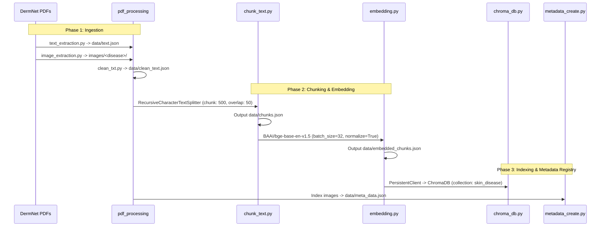

# 🩺 DermRAG: Multimodal Skin Disease Clinical Assistant

[](https://www.python.org/)
[](https://www.langchain.com/)
[](https://langchain-ai.github.io/langgraph/)
[](https://groq.com/)
[](https://www.trychroma.com/)
[](https://streamlit.io/)

An end-to-end **Multimodal Retrieval-Augmented Generation (RAG)** system designed to provide evidence-based clinical dermatology insights paired with verified photographic references. Grounded in 100 authoritative clinical condition guides from **DermNet**, this system combines dense semantic vector retrieval, agentic tool calling with LangGraph, conversation summarization middleware, and an interactive Streamlit clinical dashboard.

---

## 📑 Table of Contents

- [Overview](#-overview)
- [Key Features](#-key-features)
- [System Architecture](#-system-architecture)
- [Repository Structure](#-repository-structure)
- [Data Pipeline](#-data-pipeline)
- [Getting Started](#-getting-started)
  - [Prerequisites](#prerequisites)
  - [Installation](#installation)
  - [Environment Configuration](#environment-configuration)
- [Running the Application](#-running-the-application)
- [Evaluation & Benchmarking](#-evaluation--benchmarking)
  - [Retrieval Performance Metrics](#retrieval-performance-metrics)
  - [Latency Profiling](#latency-profiling)
- [Roadmap & Enhancements](#-roadmap--enhancements)
- [Medical Disclaimer](#-medical-disclaimer)

---

## 🔍 Overview

Dermatological evaluation heavily relies on both **textual diagnostic criteria** (etiology, pathophysiology, morphology, differential diagnosis, therapies) and **visual presentation** (photographic clinical morphology). Standard text-only LLMs often hallucinate or fail to deliver contextual visual references.

**DermRAG** solves this by:
1. **Semantic Text Retrieval**: Ingesting and indexing clinical literature across 100 skin conditions using state-of-the-art dense embeddings (`BAAI/bge-base-en-v1.5`) stored in a persistent ChromaDB vector store.
2. **Visual Evidence Retrieval**: Extracting and cataloging clinical images directly from source dermatology literature and pairing them with retrieved diagnostic findings.
3. **Agentic Conversational Orchestration**: Leveraging LangGraph and Groq-hosted `qwen/qwen3.8-27b` with autonomous tool use, multi-turn memory checkpoints, and automated summarization middleware to manage long dialogues without context drift.
4. **Interactive Clinical Dashboard**: Providing an intuitive multi-session Streamlit web application with conversation history, image cards, and configurable retrieval depths.

---

## ✨ Key Features

- **Multimodal Grounding**: Retrieves both relevant medical text passages and corresponding clinical reference images from verified source publications.
- **Agentic Workflow with LangGraph**:
  - Encapsulates vector retrieval into an autonomous tool (`search_skin_knowledge_base`).
  - Handles complex follow-up queries through query reformulation (e.g., resolving "What are its symptoms?" based on prior conversational context).
- **Automated Summarization Middleware**:
  - Automatically summarizes conversation history when exceeding 10 messages.
  - Retains the most recent 6 messages in full fidelity while compressing older dialogue, preserving context efficiency.
- **High-Fidelity Embeddings & Vector Index**:
  - Powered by `BAAI/bge-base-en-v1.5` dense embeddings (768-dimensional normalized vectors).
  - Backed by persistent ChromaDB storage with distance metric ranking.
- **Comprehensive Evaluation Suite**:
  - Evaluates retrieval quality against a curated gold-standard benchmark (`rag_evaluation_dataset-v2.json`) computing **Hit@K**, **Precision@K**, **Recall@K**, and **MRR@K**.
  - Detailed latency benchmarking analyzing cold-start vs. warm retrieval, P95 metrics, and LLM token generation speed.
- **Multi-Session Web UI**:
  - Built with Streamlit featuring a sidebar for session switching, chat renaming, new chat creation, and dynamic image limit adjustment.

---

## 🏗️ System Architecture

```mermaid
flowchart TD
    subgraph Client ["Client Interface"]
        User(["User Query"])
        UI["Streamlit Web App (app.py)"]
    end

    subgraph Agent ["LangGraph Conversational Agent"]
        Checkpointer[("InMemorySaver\n(Session Memory)")]
        Middleware["Summarization Middleware\n(Compress after 10 msgs)"]
        GroqLLM["Groq LLM\n(qwen/qwen3.8-27b)"]
        Tool["search_skin_knowledge_base\nTool Call"]
    end

    subgraph Retrieval ["Multimodal Retrieval Layer"]
        Embedder["BAAI/bge-base-en-v1.5\n(Dense Embeddings)"]
        Chroma[("ChromaDB Vector Store\n(skin_disease collection)")]
        Meta[("Image Metadata Registry\n(meta_data.json)")]
        ImgStore[("Clinical Images Store\n(images/)")]
    end

    User -->|Submit Question| UI
    UI -->|Invoke Agent| Agent
    Checkpointer <--> Agent
    Middleware <--> Agent
    Agent -->|Evaluate & Plan Query| Tool
    Tool -->|Embed Query| Embedder
    Embedder -->|Similarity Search| Chroma
    Chroma -->|Top-K Chunks + Source PDFs| Tool
    Tool -->|Match Source PDFs| Meta
    Meta -->|Fetch Image Paths| ImgStore
    ImgStore -->|Return Clinical Photos| Tool
    Tool -->|JSON (Context + Images)| GroqLLM
    GroqLLM -->|Synthesize Grounded Response| UI
    UI -->|Render Answer & Visual Reference Cards| User
```

---

## 📂 Repository Structure

```
skin_rag/
├── data/
│   ├── chroma_db/                      # Persistent ChromaDB vector database
│   ├── chunks.json                     # Segmented text chunks with source metadata
│   ├── clean_text.json                 # Preprocessed & normalized clinical text
│   ├── embedded_chunks.json            # Chunks pre-computed with 768-d BGE embeddings
│   ├── meta_data.json                  # Image metadata registry (image_id, path, disease)
│   ├── rag_evaluation_dataset-v2.json  # Curated benchmark dataset for IR evaluation
│   └── text.json                       # Raw text extracted from DermNet PDFs
├── dermnetfiles/                       # 100 clinical PDF condition guides (DermNet)
├── evaluation/
│   ├── latency.py                      # Sub-component & end-to-end latency benchmarks
│   ├── retrieval_eval.py               # IR evaluation (Hit@K, Precision@K, Recall@K, MRR@K)
│   └── retriiever_llm_latency.py       # Detailed profiling (Cold vs Warm, P95, LLM inference)
├── images/                             # Directory of clinical images organized by disease
├── src/
│   ├── pdf_processing/
│   │   ├── clean_txt.py                # Text normalization and whitespace sanitizer
│   │   ├── image_extraction.py         # Extracts photographic assets from PDFs
│   │   ├── metadata_create.py          # Generates structured metadata for extracted images
│   │   └── text_extraction.py          # Raw text extraction via PyMuPDF (fitz)
│   ├── app.py                          # Streamlit multimodal conversational UI
│   ├── chroma_db.py                    # ChromaDB vector index generation script
│   ├── chunk_text.py                   # Recursive text chunking pipeline
│   ├── config.py                       # Project configuration settings
│   ├── embedding.py                    # Embedding computation via sentence-transformers
│   ├── rag.py                          # LangGraph agent, memory checkpointer & Groq pipeline
│   ├── retrieval.py                    # Multimodal retrieval functions (text + images)
│   └── retrival_test.py                # Standalone query retrieval verification script
├── requirement.txt                     # Core project dependencies
├── .gitignore                          # Git ignore specification
└── README.md                           # Project documentation
```

---

## 🔄 Data Pipeline

The knowledge base is built from scratch through a multi-stage preprocessing pipeline:



1. **Extraction**: `fitz` (PyMuPDF) extracts raw text and embedded photographic plates from 100 DermNet clinical documents.
2. **Sanitization**: Regular expressions clean repetitive whitespace, tab indentations, and orphaned line breaks.
3. **Chunking**: `RecursiveCharacterTextSplitter` segments content into 500-character chunks with a 50-character overlap while binding metadata (`disease`, `source_pdf`).
4. **Vector Encoding**: `SentenceTransformer('BAAI/bge-base-en-v1.5')` encodes each text chunk into a normalized 768-dimensional vector.
5. **Database Ingestion**: Vectors, texts, and source tags are committed to a persistent ChromaDB instance (`data/chroma_db`).
6. **Visual Metadata**: Extracted photos are registered in `data/meta_data.json` mapping each image path to its canonical disease identifier.

---

## 🚀 Getting Started

### Prerequisites

- **Python**: Version `3.10` or higher
- **GPU**: NVIDIA GPU with CUDA support recommended for faster embedding generation (CPU inference is supported as fallback)
- **Groq API Key**: An active API key from [Groq Console](https://console.groq.com/) for LLM inference

### Installation

1. **Clone the repository**:
   ```bash
   git clone https://github.com/your-username/skin_rag.git
   cd skin_rag
   ```

2. **Create and activate a virtual environment**:
   ```bash
   python3 -m venv venv
   source venv/bin/activate    # On Windows: venv\Scripts\activate
   ```

3. **Install dependencies**:
   ```bash
   pip install --upgrade pip
   pip install -r requirement.txt
   pip install pymupdf         # Required if running PDF extraction scripts
   ```

### Environment Configuration

Create a `.env` file in the root directory (or export the variable in your shell):

```bash
export GROQ_API_KEY="your-groq-api-key-here"
```

---

## 💻 Running the Application

### 1. Launch the Streamlit Web Application

Start the multimodal assistant interface:

```bash
streamlit run src/app.py
```

Once running, navigate to `http://localhost:8501` in your browser.

- **Ask Questions**: Query about symptoms, diagnosis, causes, treatments, or differential diagnoses across 100 skin diseases.
- **Follow-up Dialogue**: Use conversational references (e.g., *"What causes it?"*, *"Is it contagious?"*); the agent resolves context using conversational memory.
- **Inspect Visual Evidence**: View side-by-side clinical image references retrieved directly from the matching medical literature.
- **Manage Sessions**: Create new conversations, toggle between chat histories, or clear session memory from the sidebar.

### 2. Standalone Retrieval Test

To verify that the vector database and embedding model are functioning properly without launching the full web UI:

```bash
python src/retrival_test.py
```

### 3. Rebuilding the Knowledge Base (Optional)

If you modify the source PDFs in `dermnetfiles/` or want to regenerate all artifacts from scratch, execute:

```bash
# 1. Extract raw text from PDFs
python src/pdf_processing/text_extraction.py

# 2. Extract clinical images
python src/pdf_processing/image_extraction.py

# 3. Clean and sanitize extracted text
python src/pdf_processing/clean_txt.py

# 4. Chunk text into passages
python src/chunk_text.py

# 5. Compute dense embeddings (CUDA/CPU)
python src/embedding.py

# 6. Populate ChromaDB collection
python src/chroma_db.py

# 7. Generate image metadata catalog
python src/pdf_processing/metadata_create.py
```

---

## 📊 Evaluation & Benchmarking

The repository includes a dedicated benchmarking suite in `evaluation/` to rigorously evaluate information retrieval quality and execution latencies.

### Retrieval Performance Metrics

The evaluation script `evaluation/retrieval_eval.py` evaluates dense retrieval against `data/rag_evaluation_dataset-v2.json` across clinical categories (etiology, treatment, complications, pathophysiology).

To execute the retrieval benchmark:

```bash
python evaluation/retrieval_eval.py
```

Metrics calculated:
- **Hit@K**: Probability that the true source document is present in top-$K$ retrieved chunks.
- **Precision@K**: Fraction of retrieved chunks matching the relevant condition source.
- **Recall@K**: Proportion of relevant documents successfully identified.
- **MRR@K (Mean Reciprocal Rank)**: Evaluates how high the correct reference document is ranked within top-$K$ results.

### Latency Profiling

Run end-to-end and component-level latency benchmarks:

```bash
# Quick sub-component vs. end-to-end latency test
python evaluation/latency.py

# Comprehensive statistical profiling (Cold-start, Warm-up, P95, LLM inference)
python evaluation/retriiever_llm_latency.py
```

#### Profiled Latency Stages:
| Stage | Component | Typical Latency (GPU / Groq) |
|---|---|---|
| **Text Retrieval** | `BAAI/bge-base-en-v1.5` + ChromaDB Query | ~10 - 25 ms |
| **Image Retrieval** | In-memory metadata matching (`meta_data.json`) | < 2 ms |
| **LLM Generation** | Groq `qwen/qwen3.8-27b` inference | ~400 - 900 ms |
| **End-to-End Pipeline** | User prompt $\to$ Agent $\to$ Tool $\to$ Answer | ~600 - 1200 ms |

---

## 🗺️ Roadmap & Enhancements

- [ ] **Cross-Encoder Reranking**: Integrate a cross-encoder model (e.g., `bge-reranker-large`) to re-score candidate passages before passing to the LLM.
- [ ] **Persistent SQL Checkpointing**: Transition LangGraph's `InMemorySaver` to PostgreSQL / SQLite for persistent multi-user chat sessions.
- [ ] **Visual Feature Embeddings (CLIP / BioMedCLIP)**: Implement multimodal vector search allowing users to upload a photo of a skin lesion and search by visual similarity.
- [ ] **Automated Medical Factuality Scoring**: Integrate Ragas or TruLens evaluation pipelines to track context precision, answer relevance, and faithfulness over time.

---

## ⚠️ Medical Disclaimer

> **IMPORTANT**: This software is developed strictly for **educational, informational, and research purposes**. It is **not** a certified medical diagnostic device and must **not** be used as a substitute for professional medical advice, clinical diagnosis, or therapeutic decision-making. Always consult a qualified dermatologist or healthcare provider regarding any medical condition.
